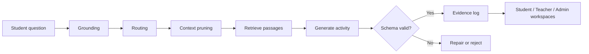

<div align="center">

# Classical Chinese Workbench

**Source-grounded learning activities for Classical Chinese, generated through retrieval, routing and schema validation.**

`FastAPI` · `LangGraph` · `ChromaDB` · `Pydantic` · `Ollama` · `Next.js`

</div>

Classical Chinese Workbench turns a learner's question into an inspectable teaching activity. Retrieved passages ground the generation process, Bloom-aligned objectives guide the activity type, and every result is validated before it reaches the student workspace.

## Highlights

- **Retrieval before generation** keeps activities connected to the source text.
- **Bloom-aligned routing** selects an instructional path based on the intended cognitive level.
- **Schema-validated output** catches malformed activities before delivery.
- **Evidence logging** preserves the sources behind every generated result.
- **Role-aware workspaces** give students, teachers and administrators distinct views of the same run record.

## End-to-end workflow



The skill registry currently includes guided explanation, question analysis, general conversation and lesson-outline generation. Each skill follows the same pipeline while using its own schema and instructional objective.

## Why the pipeline is inspectable

| Mechanism | Purpose |
| --- | --- |
| Source retrieval | Grounds the activity in selected passages rather than relying only on model memory |
| Explicit routing | Connects the learner's request to an instructional strategy |
| Pydantic validation | Enforces the expected activity structure |
| Evidence sedimentation | Records the retrieved material and run metadata for later inspection |
| Shared run record | Lets different roles inspect the same generated activity from their own workspace |

For a deeper technical view, see [`docs/ARCHITECTURE.md`](docs/ARCHITECTURE.md).

## Quick start

### 1. Install the backend

```powershell
python -m venv .venv
.\.venv\Scripts\Activate.ps1
pip install -r backend/requirements.txt
```

### 2. Install the frontend

```powershell
cd frontend
npm install
cd ..
```

### 3. Configure local inference

```powershell
Copy-Item .env.example .env
$env:SLM_OLLAMA_MODEL = "your-installed-model"
python backend/scripts/reset_demo_data.py
.\scripts\start-demo.ps1 -ResetDemoData
```

The frontend starts at `http://127.0.0.1:3000` and the API at `http://127.0.0.1:8000`. Any locally installed Ollama model can be selected through `SLM_OLLAMA_MODEL`; a local GGUF can be configured through `SLM_MODEL_PATH`.

<details>
<summary>Demo accounts and verification scripts</summary>

The demo-data script creates local accounts for `admin`, `teacher`, `student` and `student_a`. The generated demo uses `admin123456`, `teacher123456` and `student123456` for the corresponding roles.

The repository includes focused smoke checks for the backend, administrator visibility, challenge flow and MCP runtime bridge:

```powershell
python backend/scripts/smoke_backend_v1.py
python backend/scripts/smoke_admin_visibility.py
python backend/scripts/smoke_challenge_flow.py
python backend/scripts/smoke_mcp_runtime_bridge.py
```

</details>

## Repository structure

```text
backend/app/       FastAPI services, graph workflow, skills and storage
backend/scripts/   demo-data and smoke-test utilities
frontend/app/      student, teacher and administrator workspaces
docs/              architecture and demo-scope documentation
scripts/           local startup orchestration
```

## Project context

Built as a working prototype during an undergraduate research project. The repository captures the source-grounded instruction-synthesis workflow; continued research development is carried forward by the project group.

## License

See [LICENSE](LICENSE).
